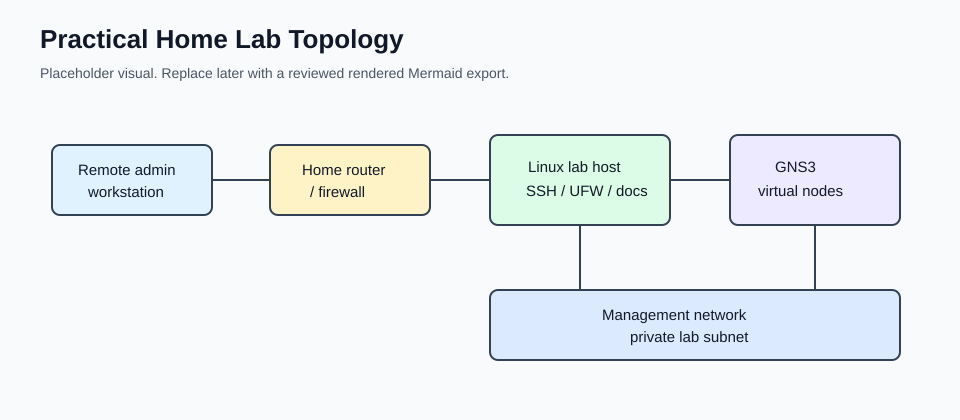

# Practical Home Lab Starter Kit for Network Engineers

Build a secure, repeatable Linux-based network engineering lab with GNS3,
Ansible, SSH hardening, UFW, Mermaid diagrams, and practical documentation
habits.

This is a free public starter kit for network engineers who want a home lab that
is easier to rebuild, explain, secure, and automate. It solves a common lab
problem: GNS3 projects, SSH access, UFW rules, Ansible inventories, diagrams,
and notes often grow separately until the lab is hard to trust.

With this repo today, you can plan a small lab topology, prepare a hardened
Linux host, connect GNS3 virtual routers and switches, run read-only Ansible
checks, copy sanitized templates, review Mermaid architecture diagrams, and run
basic validation before publishing your own lab notes.

The examples are intentionally sanitized. Copy the structure, not the literal
values. Replace lab addresses, hostnames, usernames, SSH keys, and inventories
with your own private lab details.

## Current Status

v0.1 public foundation. The repo has public-readiness docs, sanitized examples,
Mermaid diagrams, validation checks, launch assets, and a local packaging
workflow.

## Visual Preview

These SVGs are sanitized placeholders for README and demo visuals. The Mermaid
source files in [diagrams/](diagrams/) remain the canonical editable diagrams.
Reviewed screenshots or rendered exports can be added later under
[assets/](assets/).



| View | Purpose |
| --- | --- |
| [Lab topology](assets/diagrams/lab-topology-placeholder.svg) | Shows the Linux host, GNS3 server, management network, and virtual devices. |
| [Remote access flow](assets/diagrams/remote-access-flow-placeholder.svg) | Shows the trusted access path into SSH and UFW on the lab host. |
| [Ansible control flow](assets/diagrams/ansible-control-flow-placeholder.svg) | Shows inventory and read-only playbooks reaching lab devices. |

## Key Features

- Linux-based lab host setup guidance.
- GNS3 topology planning for virtual routers and switches.
- SSH and UFW hardening checklists.
- Read-only Ansible inventory and playbook examples.
- Mermaid diagrams for topology, remote access, and automation flow.
- README/demo visual placeholders under `assets/`.
- Sanitized templates for inventories, device vars, and firewall rules.
- Safe example starter scripts with dry-run behavior.
- Publication, release, redaction, and validation checklists.
- Video, demo, screenshot, and launch planning assets.

## Repo Navigation

Start with the build path:

- [docs/example-lab-topology.md](docs/example-lab-topology.md) shows the sample
  lab shape.
- [docs/linux-host-setup.md](docs/linux-host-setup.md) prepares the Linux base.
- [docs/gns3-setup.md](docs/gns3-setup.md) connects the network simulation
  layer.
- [docs/security-hardening.md](docs/security-hardening.md) covers SSH, UFW, and
  secret-handling basics.
- [docs/ansible-workflows.md](docs/ansible-workflows.md) explains the read-only
  automation flow.

Use these supporting areas:

- [diagrams/](diagrams/) contains Mermaid architecture diagrams.
- [assets/](assets/) contains README/demo visual placeholders.
- [templates/](templates/) for sanitized copyable examples.
- [ansible/](ansible/) for basic Ansible inventory and playbooks.
- [scripts/](scripts/) for validation, packaging, and safe example starter
  scripts.
- [video/](video/) for walkthrough and narration planning.
- [product/](product/) for launch, roadmap, and future bundle planning.
- [docs/release-checklist.md](docs/release-checklist.md) before publishing
  changes or release notes.
- [docs/publication-checklist.md](docs/publication-checklist.md) before sharing
  the repo publicly.

## Who This Is For

- Network engineers building automation habits outside a work environment.
- Students who want a realistic Linux, GNS3, and Ansible workflow.
- Engineers refreshing SSH, UFW, inventory, documentation, and runbook basics.
- Lab builders who want examples safe enough to adapt and publish.

## Why This Project Exists

Many home labs start as a collection of useful pieces: a GNS3 project, a Linux
box, a few SSH sessions, some Ansible experiments, and scattered notes. That is
fine for exploration, but it becomes limiting when you want the lab to be
repeatable or shareable.

This project gives the lab a simple operating model:

1. Design the topology.
2. Secure the Linux host.
3. Keep management access narrow.
4. Document the inventory.
5. Run read-only automation first.
6. Validate and redact before publishing.

## What This Is Not

- It is not a production network design.
- It is not a replacement for vendor documentation.
- It is not a collection of real device credentials or private inventories.
- It is not a promise of employment, certification, income, or operational
  readiness.
- It is not meant to expose lab services directly to the internet.

## What You Can Build

The starter kit assumes one Linux lab host, one or more GNS3 topologies, and a
small management network for automation.

```text
Admin laptop
    |
    | SSH or VPN
    v
Linux lab host
    |-- GNS3 server and projects
    |-- Ansible control directory
    |-- UFW host firewall
    |-- SSH hardened for key-based access
    |
    v
Virtual network devices on a private lab subnet
```

This is not a full enterprise design. It is a practical foundation that helps
you practice the same habits that matter in professional network engineering:
versioned configuration, repeatable commands, change notes, access control, and
rollback thinking.

## Quick Start

1. Read [docs/example-lab-topology.md](docs/example-lab-topology.md) and review
   the Mermaid diagrams in [diagrams/](diagrams/).
2. Prepare a current Ubuntu Server or Debian host using
   [docs/linux-host-setup.md](docs/linux-host-setup.md).
3. Apply SSH and UFW guardrails from
   [docs/security-hardening.md](docs/security-hardening.md).
4. Build a small GNS3 topology with a private management subnet.
5. Copy `ansible/inventory.example.ini` to a local untracked inventory file and
   replace placeholder values with your own private lab values.
6. Run the read-only Ansible checks against test devices.
7. Run validation and redaction checks before publishing any notes.

Safe example scripts:

```bash
./scripts/bootstrap-lab-host.example.sh
./scripts/setup-ufw-baseline.example.sh
./scripts/validate-lab-host.example.sh
```

The bootstrap and UFW examples are dry-run by default. Review them before
running with `APPLY=1`.

Example Ansible workflow:

```bash
ansible-inventory -i ansible/inventory.example.ini --list
ansible-playbook -i ansible/inventory.example.ini ansible/playbooks/ping-lab.yml
ansible-playbook -i ansible/inventory.example.ini ansible/playbooks/show-version.yml
```

Validation commands:

```bash
./scripts/validate.sh
./scripts/redaction-check.sh
bash -n scripts/validate.sh scripts/redaction-check.sh scripts/package-release.sh
git diff --check
```

## Visual Architecture

The diagram source files are stored as Mermaid text so they can support the
README, a blog post, a future PDF bundle, and a short video walkthrough.

- [diagrams/lab-topology.mmd](diagrams/lab-topology.mmd) shows the full lab
  topology.
- [diagrams/remote-access-flow.mmd](diagrams/remote-access-flow.mmd) shows the
  trusted access path into the Linux lab host.
- [diagrams/ansible-control-flow.mmd](diagrams/ansible-control-flow.mmd) shows
  how inventory, group variables, and playbooks reach virtual lab devices.
- [docs/diagram-guide.md](docs/diagram-guide.md) explains how to use and
  maintain the diagrams.

## Repository Map

- [docs/architecture.md](docs/architecture.md) explains the reference design.
- [docs/linux-host-setup.md](docs/linux-host-setup.md) walks through the host
  baseline.
- [docs/gns3-setup.md](docs/gns3-setup.md) covers GNS3 setup and project
  hygiene.
- [docs/security-hardening.md](docs/security-hardening.md) gives a practical
  SSH, UFW, and maintenance checklist.
- [docs/remote-access.md](docs/remote-access.md) covers safer remote access
  patterns.
- [docs/ansible-workflows.md](docs/ansible-workflows.md) introduces the sample
  Ansible inventory and playbooks.
- [docs/troubleshooting.md](docs/troubleshooting.md) collects common failure
  modes and checks.
- [templates/](templates/) contains copyable sanitized examples.
- [ansible/](ansible/) contains basic working Ansible examples.

## Suggested Lab Standards

- Use private lab address space only, such as `10.10.10.0/24`.
- Keep device names boring and descriptive, such as `lab-r1` or `gns3-sw1`.
- Use SSH keys instead of reusable shared passwords.
- Keep real inventories, vault files, and secrets out of Git.
- Write down every topology assumption before troubleshooting automation.
- Treat the lab host like infrastructure, not like a disposable laptop.

## Example Workflow

1. Start a GNS3 topology with one router and one switch.
2. Confirm the Linux host can reach the device management interfaces.
3. Add devices to a sanitized Ansible inventory.
4. Run `ansible/playbooks/ping-lab.yml` to verify reachability.
5. Run `ansible/playbooks/show-version.yml` to collect basic facts.
6. Save notes about what changed, what worked, and what needs cleanup.

## Future Roadmap

Planned directions for later phases:

- More GNS3 lab scenarios.
- Configuration backup and comparison workflows.
- Expanded troubleshooting guides.
- Rendered diagram packs for README, blog, and PDF usage.
- More short-form walkthrough videos.
- Optional paid PDF/template bundle with worksheets and deeper scenarios.

The free repo is designed to stand on its own. A future paid PDF/template bundle
may add a more polished workbook, expanded topology diagrams, lab worksheets,
checklists, and deeper troubleshooting examples.

The free material will remain useful as a public starting point.

See [product/free-vs-paid-scope.md](product/free-vs-paid-scope.md) for the
current boundary between public content and possible future bundle material.

## Security Notice

All examples in this repository must be sanitized. Do not commit real passwords,
PSKs, private keys, tokens, customer data, public-facing addresses, account
details, or private environment information.

Before committing changes, run:

```bash
./scripts/redaction-check.sh
```
